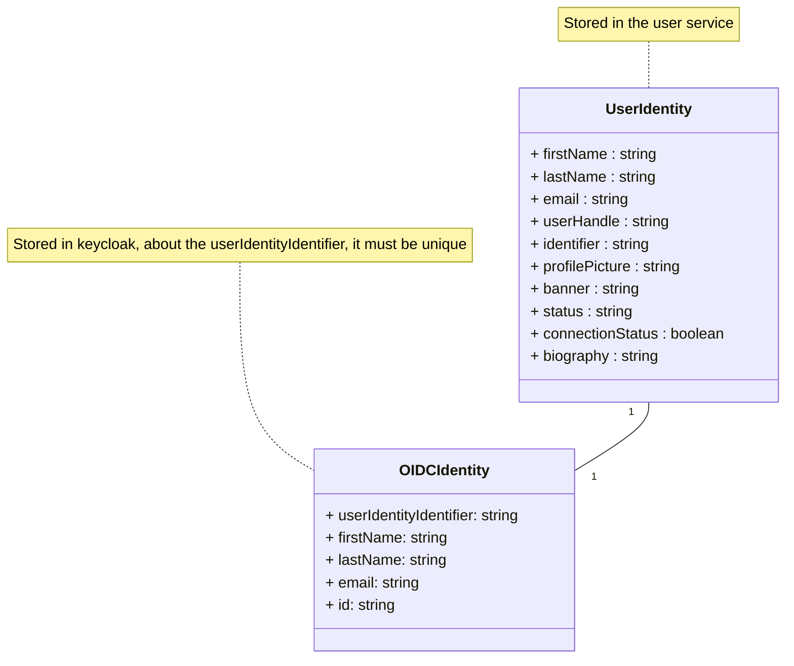
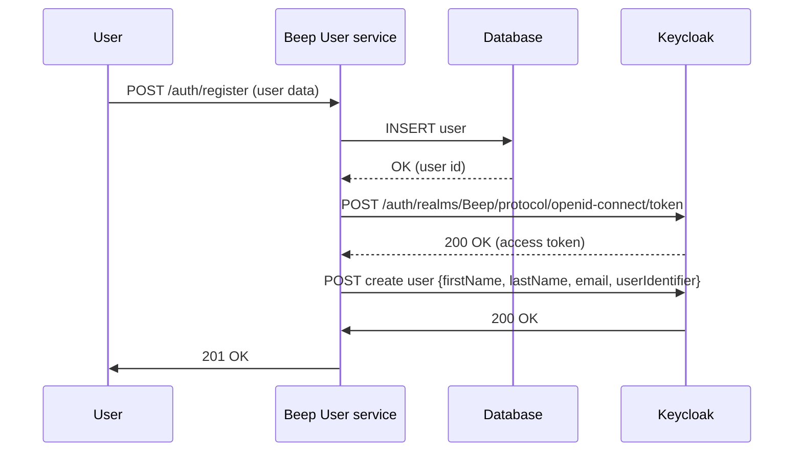

##  How do I manage the authentication system with an OIDC ?

Important points to tackle : 
- Authentication between microservices
- Authentication between Beep and the user

## Architecture
As defined in the previous question, Beep infrastructure will be as follows : 
![[architecture.png]]
In a first time let's not focus on the "gateway" part of this infrastructure nor the data management but on the **authentication** and **identity management**.

The user is defined by the following data :
- a first name
- a last name
- a user handle
- an email
- a unique identifier
- a profile picture
- a banner
- a status (active, inactive, sleeping, mysterious...)
- a connection status (connected or disconnected).
- a biography

And finally, we will be using `keycloak` as the identity manager because it is a constraint given by the project manager.

There will be two services managing the authentication part of the user : Keycloak as the identity manager and a `user service` used to store user data. Even though Keycloak provides great features to store basic user identity data such as first name, last name. There is a lot of business logic that goes beyond the OIDC protocol (that will be developed in the following sections) to implement regarding user identity management. For instance, connection status relies on weather or not the user is currently using the system. This event will update a field in Beep's user data model. Also, exposing a keycloak directly to the world doesn't feel right because attackers could exploit it freely.

## Keycloak realms management
Our keycloak instance will be composed of two realms (a realm manages a set of users, credentials, roles, and groups. A user belongs to and logs into a realm. Realms are isolated from one another and can only manage and authenticate the users that they control.):
- Beep
    - This realm will be used to store user data
- master
    - Used for keycloak administration

## User service responsibilities
The user service will be responsible for the following :
- Storing user data
- Calling keycloak to create the user identity

## User creation
In a nutshell, user creation must go through three steps : 
1. Getting user data from the identity provider (either a registration form, polytech LDAP or a social media...)
2. Saving that data in the user service
3. Registering an identity in keycloak so later we can bind keycloak user identity to the user service

This third will actually be divided into two steps : 
1. Registering the user in keycloak
2. Add a custom attribute to the user in keycloak which is its identifier from the user service

The relationship between the user service and keycloak is as follows :

Though, we can use keycloak as an [identity broker](https://www.keycloak.org/docs/latest/server_admin/index.html). An identity broker is a service that can be used to map a user identity from a service provider (e.g. Google) to another service (here Beep).
Keycloak bases identity providers on the following protocols:
- SAML v2.0
- Open ID Connect v1.0
- Oauth v2.0

### User creates Beep account (vanilla)

In this case, the user data is coming from a registration form in the frontend.

### User creates Beep account (polytech LDAP)

LDAP is a user federation protocol that allows to manage user identities from a centralized directory. The integration with keycloak
consists in importing the user data from the LDAP directory into keycloak thus by default, every Polytech student will have an identity in Beep.
