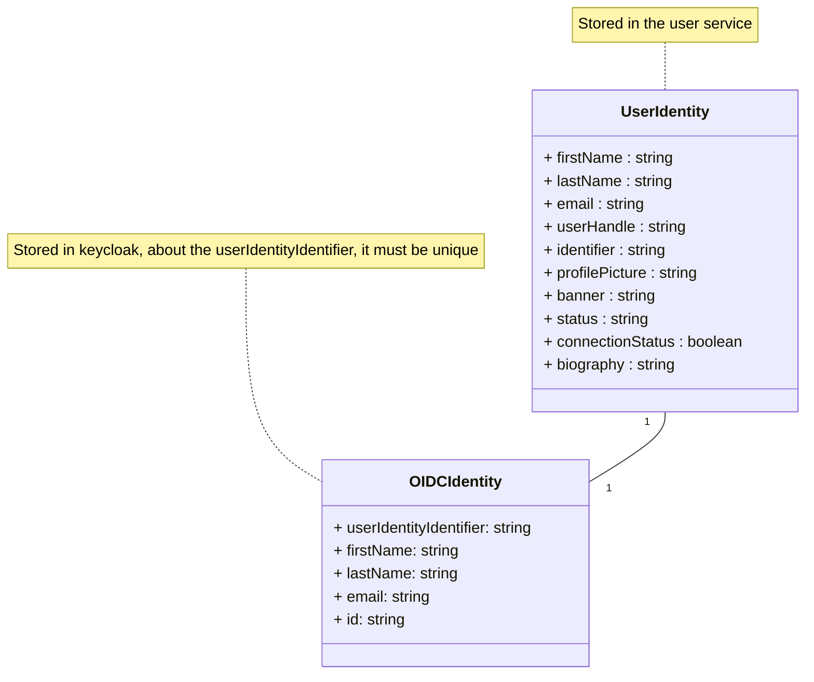
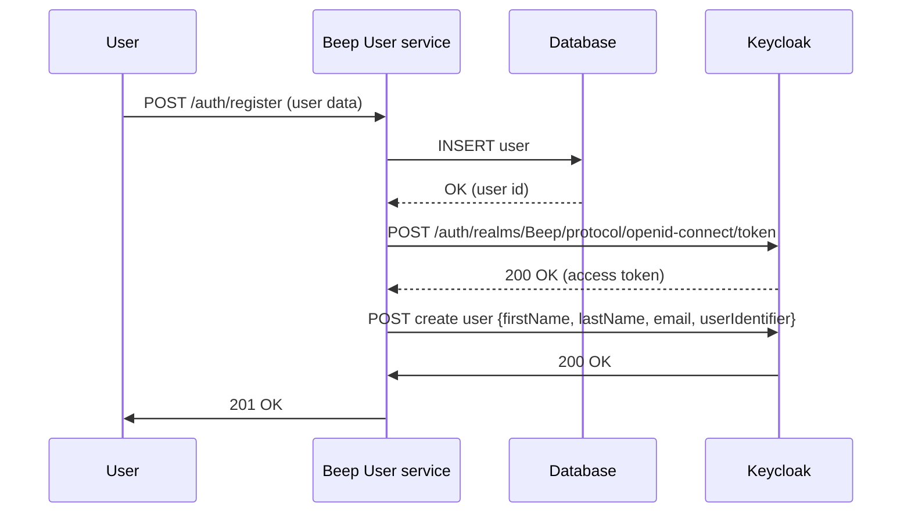

# Draft for Beep Sprint 6

## Q1: Starting with the prerequisites, what do you propose to separate your application into functional neighborhoods and microservices ?
### 1.1. Enumerations of current features :
#### 1.1.1. Authentication
**User** : person that uses beep
- As a visitor I can sign up to beep. I will provide my first name, last name, username, email, password and a picture of me.
- Then I will be able to sign in by providing my email and password.
- Eventually I will be able to activate the 2FA, so when I sign into beep I will be asked to enter 2FA code.
- I also want to be able to log out so I can switch account.
This part we will be detailled further on throught the second question since most of these feature are answered thanks to an OIDC.
#### 1.1.2. Servers
Note: from now on we will consider the user to be authenticated but with the least ammount of privileges.
- As a user I want to be able to **discover public servers** thanks to a **search feature**.
- Also I want to be able to join a **public server** so I can join a community.
- Also I want to be able to join a **private server** thanks to either an **invitation link** OR an in-app invitation (not yet implemented).
- Once in a server I want to be able to **see channels**, and **messages**, also I want to be able to **join voice calls**
- As a user I want to create a server either **public** or **private** depending on the level of visibility I want. I want to be able to name my server to make it unique or at least recognizable.
- As a **server admin**, I want to be able to add a name to the server, a picture, a banner and a description so my server becomes unique !
- As a **server admin** I want to be able to manage everything a user can do **within** my server thanks to a role system. It means that every resources -> **message** and **channels** are impacted by these roles.
- As a **server admin** I want to be able to destroy my server.
- As a **server member** I want to be able to invite my friends to the server if its public. If it's private, I need to be an admin.
#### 1.1.3. Channels
- As a **server admin** I want to be able to create channels within a server.
- Still as a **server admin** I want to be able to create **text channels** or **voice channels** to either send messages or discuss directly with my friends in vocal.
- Things can get messy, so as a **server admin** I a want a system of **folder channels** to regroup text channels and voice channels.
- As a **channel admin** I want to be able to edit its name.
- As a **folder channel admin** I want to be able to edit its name.
- As a **channel admin** I want to set who can see the channel, thus introducing **private channels**.
-  As a **channel admin** I want to be able to delete a channel and if it's a folder channel, all its subsequent channels.
- As a **channel member** I want to be able to see who are the other members and if they are connected in real time.
#### 1.1.4. User
- As a user I want to be able to **choose the language** of beep. For now either **english** or **french**.
- I want to be able to select my **audio inputs** and **video inputs** for video calls.
- I want to be able to change my **name, last name, username, email and profile picture**.
- I want to be able to change my **password**.
#### 1.1.5. Voice calls
- I want to be able to join voice calls to chat with other beep users.
- I want to be able to see who's in the voice call.
- I want to be able to see my friends cameras and share my camera only if I want it.
- I want to be able to share my screen to the people in the call.
- I want to be able to mute myself when in a voice call.
- I want to be able to leave a voice call.
#### 1.1.6. Messages
- I want to send a text message to other users.
- I want to be able to **delete** my text messages. Or if I have enough right, delete other people messages
	- I want to be able to edit my text messages.
- I want to be able to pin the current message to the channel where the conversation is to retrieve them later.
- I want to be able to answer to any messages to keep a conversation.
- I want to be able to see who sent a message and when.
- I want my text messages to support markdown and youtube, spotify, twitter integration to preview links.
- I want to be able to join files to my messages.
- I want to be able to ping other users that are on the channel/server in a message by typing @<username\>
- I want to be able to tag a channel with a \#<channel-name\>
- I want to be notified when I'm pinged on a channel.
- I want to be notified when receiving a message but with a level not as high as when I'm pinged.
- I want to be able to snooze these notifications
#### 1.1.7. Friends
- I want to be able to discuss directly to other users thanks to a direct message system.
- To manage my inbox, I want to be able to ask other users to be my friend
- When someone asks me to be his friend, obviously I want to see the ask and see the asker identity
- I want to deny or accept a friend ask.
- I want to be able to remove friends so we are not friend anymore. This will automatically erase our conversation.
- I want to be notified when receiving a friend ask.
- I want to be able to snooze these notifications.
#### 1.1.8. Automations
- Message can be sent automatically to a channel thanks to webhooks
- A user in a **channel** with the correct authorizations can create a webhook to automatically send messages to a channel
- A webhook owner can delete it
- A webhook owner can edit it

## Defining the ubiquitous language
From our feature list we can extract a domain specific vocabulary. You may have observed that some words were highlighted previously.
- **user** : a user of Beep which identity has been registered.
- **entity**: an entity contains itself another component of beep. For example, a server is an entity because it contains channels. **Channels** are an entity because it contains **channels**, **messages** or **voice calls**.
- **server** : an entity that helps to regroup **channels**.
- **channels** : an entity that contains either **channels**, **messages** or a **voice call**
- **text channel** : a **channel** that only contains texts.
- **voice channel** : a **channel** that enable **voice calls**
- **folder channel** : a **channel** that contains **channels**.
- **message** : a text that is sent to another **user** and that might contain an attachment **file**
- **file** : it can be either a binary, image, video, text.... that can be stored in a computer filesystem.
- **member** : a member is part of an **entity**. It has associated **rights** and is associated to a **user**.
- **voice call** : a connection between **users** to support realtime audio calls + video calls.
- **notification** : an alert sent to a user making him aware of an event.
## Defining the bounded contexts of the domains
- **user** : everything that is related to identity management of the user.
- **server** : managing the metadata of a server, the list of channels and its related policies.
- **channels** : managing the metadata of channels and its related policies.
- **message** : everything related to the management of messages through the application, the storage and its structure.
- ****
## Breaking the monolith

Now that we have defined the different features of our application, we now want to define the different relationships between each group of features.
Group of features are features that can't be decoupled. For example, editing a message needs the feature *sending a message* to be implemented because otherwise you would have no message to be existing.
These relationships are highlighted when a domain name is appearing in another feature.
![[domains.png]]
From now on we can already see the different atomic services that can be extracted from our monolith. And good news ! It already quite follows the architecture of beep's backend : 
```bash
$ ls beep/api/apps
.
├── authentication
├── channels
├── friends
├── healthcheck
├── invitations
├── members
├── messages
├── notification
├── roles
├── servers
├── storage
├── users
└── webhooks
```


## need to talk about the multi-tenant aspect of the application and how should the API be exposed

##  Q2: How do I manage the authentication system with an OIDC ?

Important points to tackle : 
- Authentication between microservices
- Authentication between Beep and the user

## Architecture
As defined in the previous question, Beep infrastructure will be as follows : 
![[architecture.png]]
In a first time let's not focus on the "gateway" part of this infrastructure nor the data management but on the **authentication** and **identity management**.

The user is defined by the following data :
- a first name
- a last name
- a user handle
- an email
- a unique identifier
- a profile picture
- a banner
- a status (active, inactive, sleeping, mysterious...)
- a connection status (connected or disconnected).
- a biography

And finally, we will be using `keycloak` as the identity manager because it is a constraint given by the project manager.

There will be two services managing the authentication part of the user : Keycloak as the identity manager and a `user service` used to store user data. Even though Keycloak provides great features to store basic user identity data such as first name, last name. There is a lot of business logic that goes beyond the OIDC protocol (that will be developed in the following sections) to implement regarding user identity management. For instance, connection status relies on weather or not the user is currently using the system. This event will update a field in Beep's user data model. Also, exposing a keycloak directly to the world doesn't feel right because attackers could exploit it freely.

## Keycloak realms management
Our keycloak instance will be composed of two realms (a realm manages a set of users, credentials, roles, and groups. A user belongs to and logs into a realm. Realms are isolated from one another and can only manage and authenticate the users that they control.):
- Beep
    - This realm will be used to store user data
- master
    - Used for keycloak administration

## User service responsibilities
The user service will be responsible for the following :
- Storing user data
- Calling keycloak to create the user identity

## User creation
In a nutshell, user creation must go through three steps : 
1. Getting user data from the identity provider (either a registration form, polytech LDAP or a social media...)
2. Saving that data in the user service
3. Registering an identity in keycloak so later we can bind keycloak user identity to the user service

This third will actually be divided into two steps : 
1. Registering the user in keycloak
2. Add a custom attribute to the user in keycloak which is its identifier from the user service

The relationship between the user service and keycloak is as follows :



Though, we can use keycloak as an [identity broker](https://www.keycloak.org/docs/latest/server_admin/index.html). An identity broker is a service that can be used to map a user identity from a service provider (e.g. Google) to another service (here Beep).
Keycloak bases identity providers on the following protocols:
- SAML v2.0
- Open ID Connect v1.0
- Oauth v2.0

### User creates Beep account (vanilla)

In this case, the user data is coming from a registration form in the frontend.



### User creates Beep account (polytech LDAP)

LDAP is a user federation protocol that allows to manage user identities from a centralized directory. The integration with keycloak
consists in importing the user data from the LDAP directory into keycloak thus by default, every Polytech student will have an identity in Beep.

### References

### Service mesh
https://chrishaessig.medium.com/keycloak-with-istio-and-oauth2-proxy-65227a383c15
### Keycloak
https://www.keycloak.org/docs/latest/authorization_services/index.html#_overview_architecture
phantom token -> https://www.youtube.com/watch?v=hTgff3cJ6AU&start=1872
### Domain driven design
https://www.amazon.fr/Domain-Driven-Design-Tackling-Complexity-Software/dp/0321125215/ref=asc_df_0321125215?mcid=7a13d034d8b23299b823b401fb12e7c0&tag=googshopfr-21&linkCode=df0&hvadid=701413550127&hvpos=&hvnetw=g&hvrand=2911766027570526990&hvpone=&hvptwo=&hvqmt=&hvdev=c&hvdvcmdl=&hvlocint=&hvlocphy=9055317&hvtargid=pla-449269547899&psc=1&gad_source=1

