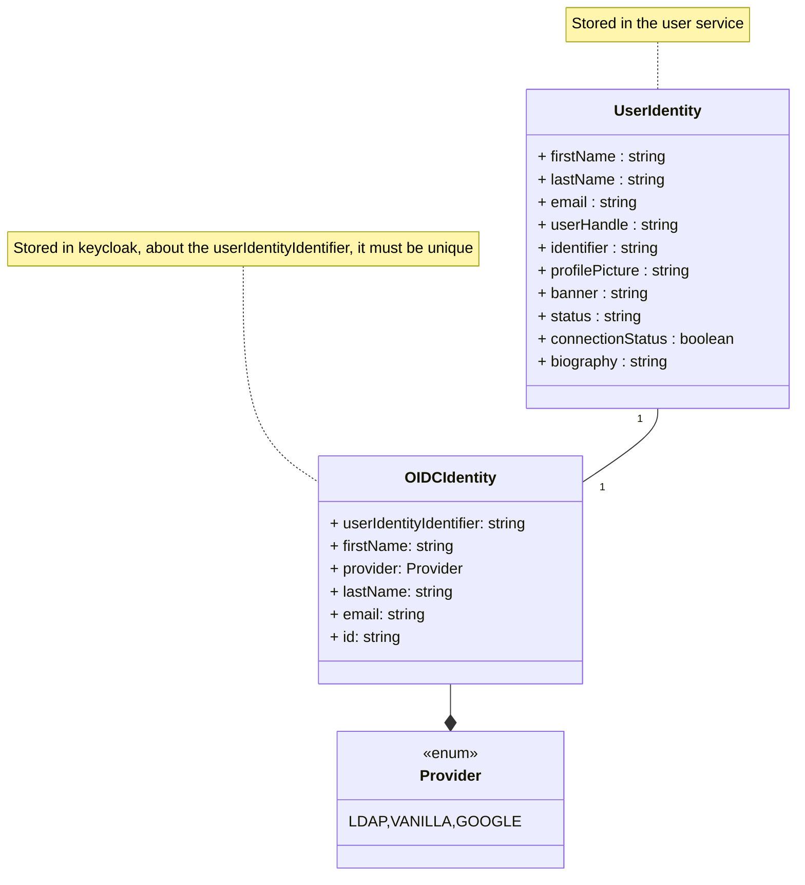
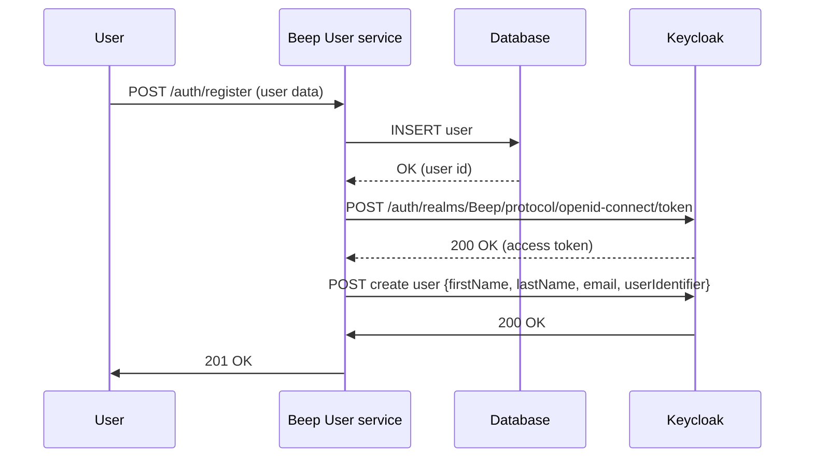
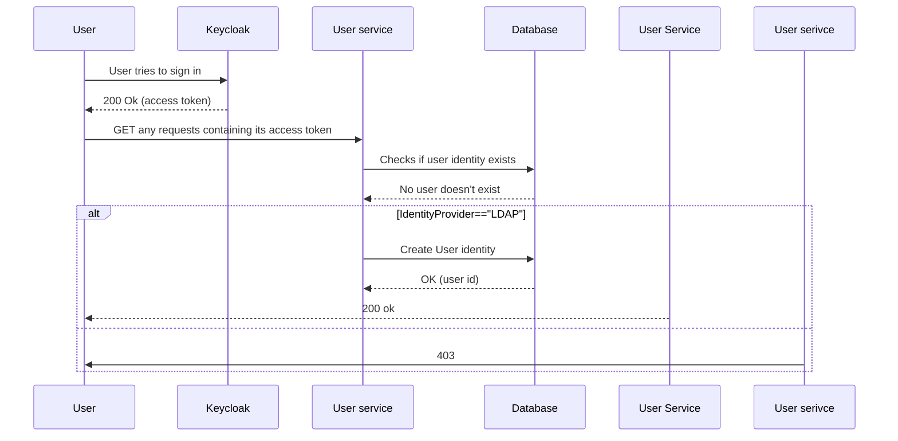
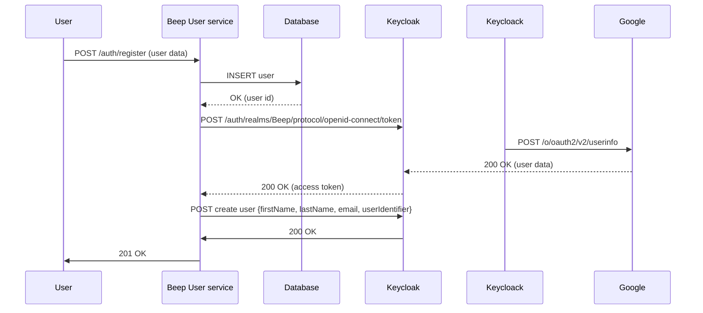

# Beep - TAD


## Breaking the monolith
### 1.1. Enumerations of current features :
#### 1.1.1. Authentication
**User** : person that uses beep
- As a visitor I can sign up to beep. I will provide my first name, last name, username, email, password and a picture of me.
- Then I will be able to sign in by providing my email and password.
- Eventually I will be able to activate the 2FA, so when I sign into beep I will be asked to enter 2FA code.
- I also want to be able to log out so I can switch account.
This part we will be detailled further on throught the second question since most of these feature are answered thanks to an OIDC.
#### 1.1.2. Servers
Note: from now on we will consider the user to be authenticated but with the least ammount of privileges.
- As a user I want to be able to **discover public servers** thanks to a **search feature**.
- Also I want to be able to join a **public server** so I can join a community.
- Also I want to be able to join a **private server** thanks to either an **invitation link** OR an in-app invitation (not yet implemented).
- Once in a server I want to be able to **see channels**, and **messages**, also I want to be able to **join voice calls**
- As a user I want to create a server either **public** or **private** depending on the level of visibility I want. I want to be able to name my server to make it unique or at least recognizable.
- As a **server admin**, I want to be able to add a name to the server, a picture, a banner and a description so my server becomes unique !
- As a **server admin** I want to be able to manage everything a user can do **within** my server thanks to a role system. It means that every resources -> **message** and **channels** are impacted by these roles.
- As a **server admin** I want to be able to destroy my server.
- As a **server member** I want to be able to invite my friends to the server if its public. If it's private, I need to be an admin.
#### 1.1.3. Channels
- As a **server admin** I want to be able to create channels within a server.
- Still as a **server admin** I want to be able to create **text channels** or **voice channels** to either send messages or discuss directly with my friends in vocal.
- Things can get messy, so as a **server admin** I a want a system of **folder channels** to regroup text channels and voice channels.
- As a **channel admin** I want to be able to edit its name.
- As a **folder channel admin** I want to be able to edit its name.
- As a **channel admin** I want to set who can see the channel, thus introducing **private channels**.
-  As a **channel admin** I want to be able to delete a channel and if it's a folder channel, all its subsequent channels.
- As a **channel member** I want to be able to see who are the other members and if they are connected in real time.
#### 1.1.4. User
- As a user I want to be able to **choose the language** of beep. For now either **english** or **french**.
- I want to be able to select my **audio inputs** and **video inputs** for video calls.
- I want to be able to change my **name, last name, username, email and profile picture**.
- I want to be able to change my **password**.
#### 1.1.5. Voice calls
- I want to be able to join voice calls to chat with other beep users.
- I want to be able to see who's in the voice call.
- I want to be able to see my friends cameras and share my camera only if I want it.
- I want to be able to share my screen to the people in the call.
- I want to be able to mute myself when in a voice call.
- I want to be able to leave a voice call.
#### 1.1.6. Messages
- I want to send a text message to other users.
- I want to be able to **delete** my text messages. Or if I have enough right, delete other people messages
	- I want to be able to edit my text messages.
- I want to be able to pin the current message to the channel where the conversation is to retrieve them later.
- I want to be able to answer to any messages to keep a conversation.
- I want to be able to see who sent a message and when.
- I want my text messages to support markdown and youtube, spotify, twitter integration to preview links.
- I want to be able to join files to my messages.
- I want to be able to ping other users that are on the channel/server in a message by typing @<username\>
- I want to be able to tag a channel with a \#<channel-name\>
- I want to be notified when I'm pinged on a channel.
- I want to be notified when receiving a message but with a level not as high as when I'm pinged.
- I want to be able to snooze these notifications
#### 1.1.7. Friends
- I want to be able to discuss directly to other users thanks to a direct message system.
- To manage my inbox, I want to be able to ask other users to be my friend
- When someone asks me to be his friend, obviously I want to see the ask and see the asker identity
- I want to deny or accept a friend ask.
- I want to be able to remove friends so we are not friend anymore. This will automatically erase our conversation.
- I want to be notified when receiving a friend ask.
- I want to be able to snooze these notifications.
#### 1.1.8. Automations
- Message can be sent automatically to a channel thanks to webhooks
- A user in a **channel** with the correct authorizations can create a webhook to automatically send messages to a channel
- A webhook owner can delete it
- A webhook owner can edit it

## Defining the ubiquitous language
From our feature list we can extract a domain specific vocabulary. You may have observed that some words were highlighted previously.
- **user** : a user of Beep which identity has been registered.
- **entity**: an entity contains itself another component of beep. For example, a server is an entity because it contains channels. **Channels** are an entity because it contains **channels**, **messages** or **voice calls**.
- **server** : an entity that helps to regroup **channels**.
- **channels** : an entity that contains either **channels**, **messages** or a **voice call**
- **text channel** : a **channel** that only contains texts.
- **voice channel** : a **channel** that enable **voice calls**
- **folder channel** : a **channel** that contains **channels**.
- **message** : a text that is sent to another **user** and that might contain an attachment **file**
- **file** : it can be either a binary, image, video, text.... that can be stored in a computer filesystem.
- **member** : a member is part of an **entity**. It has associated **rights** and is associated to a **user**.
- **voice call** : a connection between **users** to support realtime audio calls + video calls.
- **notification** : an alert sent to a user making him aware of an event.
## Defining the bounded contexts of the domains
- **user** : everything that is related to identity management of the user.
- **server** : managing the metadata of a server, the list of channels and its related policies.
- **channels** : managing the metadata of channels and its related policies.
- **message** : everything related to the management of messages through the application, the storage and its structure.
- ****
## Breaking the monolith

Now that we have defined the different features of our application, we now want to define the different relationships between each group of features.
Group of features are features that can't be decoupled. For example, editing a message needs the feature *sending a message* to be implemented because otherwise you would have no message to be existing.
These relationships are highlighted when a domain name is appearing in another feature.
![[domains.png]]
From now on we can already see the different atomic services that can be extracted from our monolith. And good news ! It already quite follows the architecture of beep's backend : 
```bash
$ ls beep/api/apps
.
├── authentication
├── channels
├── friends
├── healthcheck
├── invitations
├── members
├── messages
├── notification
├── roles
├── servers
├── storage
├── users
└── webhooks
```


## Multi tenant aspect of the application

The differents services of the application have been designed to be multi-tenant. Each tenant is actually a server. The multi-tenant features are :
- Servers
- Channels (text, folder and voice)

Actually, defining a two user chat (private messages) as a dedicated server but with a custom frontend make it very easy because the code responsible for servers can be reused in private channels.

To leverage the multi-tenant aspect of the application effectively, we need to implement a robust strategy for data sharding between tenants. Data sharding involves distributing data across multiple databases or partitions based on the tenant identifier. This approach not only enhances data isolation and security but also significantly improves performance and scalability.

### Data Sharding for Performance and Scalability

By sharding data between tenants, we can distribute the load evenly across multiple database instances. Each tenant's data is stored in a separate shard, which can be hosted on different physical or virtual servers. This distribution reduces contention and bottlenecks, as each shard can handle a smaller subset of the overall data. For example, if we have 100 tenants, we can distribute them across 10 shards, with each shard handling data for 10 tenants. This approach ensures that no single database instance is overwhelmed with traffic, leading to improved query performance and reduced latency.

Sharding also facilitates horizontal scaling. As the number of tenants grows, we can simply add more shards to accommodate the increased load. This scalability is crucial for maintaining performance and availability as the application grows. Additionally, sharding allows for more efficient use of resources, as each shard can be independently scaled and managed based on the specific needs of the tenants it serves.

### Simplifying Domain Separation and Developer Experience

In terms of code, treating servers as tenants simplifies the developer experience (DX) and the separation of domains. By incorporating the tenant identifier into the API requests and database queries, we can ensure that all operations are scoped to the correct tenant. This approach makes it easier to implement and enforce tenant-specific policies, such as role-based access control (RBAC) and data isolation.

For example, when a user requests data from a server, the API can use the tenant identifier to route the request to the appropriate shard. This ensures that the user only accesses data within their tenant's context, enhancing security and compliance. Similarly, when performing operations like creating or deleting a server, the API can use the tenant identifier to apply the correct policies and permissions.

This clear separation of domains based on tenants also simplifies the development and maintenance of the application. Developers can focus on implementing features and logic within the context of a single tenant, knowing that the data and operations are isolated from other tenants. This isolation reduces the risk of data leakage and ensures that changes to one tenant's data or configuration do not affect other tenants.

In summary, implementing data sharding between tenants improves performance and scalability by distributing the load evenly and reducing contention. It also simplifies the developer experience and the separation of domains by treating servers as tenants, ensuring data isolation, security, and compliance. This approach allows for efficient resource utilization and scalability while maintaining a clear and manageable architecture.


## Managing authentication in Beep

Important points to tackle : 
- Authentication between microservices
- Authentication between Beep and the user

## Architecture
As defined in the previous question, Beep infrastructure will be as follows : 
![[architecture.png]]
In a first time let's not focus on the "gateway" part of this infrastructure nor the data management but on the **authentication** and **identity management**.

The user is defined by the following data :
- a first name
- a last name
- a user handle
- an email
- a unique identifier
- a profile picture
- a banner
- a status (active, inactive, sleeping, mysterious...)
- a connection status (connected or disconnected).
- a biography

And finally, we will be using `keycloak` as the identity manager because it is a constraint given by the project manager.

There will be two services managing the authentication part of the user : Keycloak as the identity manager and a `user service` used to store user data. Even though Keycloak provides great features to store basic user identity data such as first name, last name. There is a lot of business logic that goes beyond the OIDC protocol (that will be developed in the following sections) to implement regarding user identity management. For instance, connection status relies on weather or not the user is currently using the system. This event will update a field in Beep's user data model. Also, exposing a keycloak directly to the world doesn't feel right because attackers could exploit it freely.

## Keycloak realms management
Our keycloak instance will be composed of two realms (a realm manages a set of users, credentials, roles, and groups. A user belongs to and logs into a realm. Realms are isolated from one another and can only manage and authenticate the users that they control.):
- Beep
    - This realm will be used to store user data
- master
    - Used for keycloak administration

## User service responsibilities
The user service will be responsible for the following :
- Storing user data
- Calling keycloak to create the user identity

## User creation
In a nutshell, user creation must go through three steps : 
1. Getting user data from the identity provider (either a registration form, polytech LDAP or a social media...)
2. Saving that data in the user service
3. Registering an identity in keycloak so later we can bind keycloak user identity to the user service

This third will actually be divided into two steps : 
1. Registering the user in keycloak
2. Add a custom attribute to the user in keycloak which is its identifier from the user service

The relationship between the user service and keycloak is as follows :



Though, we can use keycloak as an [identity broker](https://www.keycloak.org/docs/latest/server_admin/index.html). An identity broker is a service that can be used to map a user identity from a service provider (e.g. Google) to another service (here Beep).
Keycloak bases identity providers on the following protocols:
- SAML v2.0
- Open ID Connect v1.0
- Oauth v2.0

### User creates Beep account (vanilla)

In this case, the user data is coming from a registration form in the frontend.



### User creates Beep account (polytech LDAP)

LDAP is a user federation protocol that allows to manage user identities from a centralized directory. The integration with keycloak consists in importing the user data from the LDAP directory into keycloak thus by default, every Polytech student will have an identity in Beep. Still, by default they won't be considered as fully registered since the _User service_ won't register their identity.
A user will only be created if they try to log into Beep with their polytech account.

Note that before hand, keycloak will contain the polytech user id and password since they will be imported from the LDAP thanks to LDAP integration.


As you can see on the diagram, if the IdentityProvider is LDAP, then it will create an identity in the user service.

### User creates Beep account (Google)

In this case, the user data is retrieved from Google thanks to the OpenID Connect protocol.



## Inter microservices communication

How will you orchestrate inter-microservice communication? API systems? Protocols used, etc.
Explain your approach
Make a sequence diagram of the communication between some of your services to present your approach.
Make a POC of communication between two microservices (helloworld) using the system you intend to implement.

## Needs (introduction)

### Communication between microservices

Beep services need to communicate with each other to exchange data. Developers must be able to iterate quickly between services and be able to test their changes without having to restart the whole application. This means that each service need to document very explicitely each of its endpoints.


### Service discovery

In a microservices architecture, services need to be able to discover each other. This is important because Beep services will be deployed on different servers and we need to be able to route requests to the right service. If a service is down, the rest of the infrastructure need to alert it to make sure that the error doesn't last for too long.

## Options 

### Communication protocols

In a distributed context, managing communication between microservices involves several key considerations. One of the first decisions to make is the protocol that will facilitate this communication. There are two primary options: REST API and gRPC. Each has its own advantages and trade-offs, and the choice depends on the specific requirements and constraints of the system.

### REST API

The REST API protocol is widely used for communication between microservices using HTTP requests. It leverages standard HTTP verbs such as GET, POST, PUT, and DELETE to define the type of request and the expected response. One of the significant advantages of REST is its simplicity and ubiquity. Most developers are familiar with HTTP and REST, making it easier to implement and maintain. Additionally, REST is stateless, which aligns well with the stateless nature of microservices.

Another benefit of REST is the ability to generate documentation and type-safe clients based on an API schema using OpenAPIv3. This can significantly improve developer productivity and ensure consistency across different services. Tools like Swagger can be used to generate interactive API documentation, which can be exposed via an endpoint such as `kubernetes.local/<my-service>/docs`. This documentation serves as a contract between services, clearly defining the expected inputs and outputs for each API endpoint.

However, REST was not originally designed with type safety in mind. While tools like OpenAPIv3 and Swagger can help mitigate this, they add an additional layer of complexity. The contract between services is defined in a file called `docs/openapi.yaml`, which is used to generate both the documentation and the client. This approach ensures that all services adhere to the same contract, reducing the risk of mismatches and errors.

### gRPC

gRPC is another protocol used for communication between microservices, leveraging the concept of Remote Procedure Calls (RPC). It is a type-safe and battle-tested protocol that has been widely adopted in the industry. gRPC uses Protocol Buffers (protobufs) as its interface definition language (IDL), which allows for efficient serialization and deserialization of data. This makes gRPC particularly suitable for high-performance and low-latency applications.

One of the key advantages of gRPC is its type safety. The protocol ensures that the data types and structures are consistent across services, reducing the risk of errors and mismatches. Additionally, gRPC supports bi-directional streaming, which can be useful for real-time applications that require continuous data exchange.

gRPC also offers built-in support for code generation. The protocol definitions can be used to generate client and server code in multiple languages, ensuring consistency and reducing the amount of boilerplate code. This can significantly improve developer productivity and ensure that all services adhere to the same contract.

### Choosing Between REST and gRPC

While gRPC offers several advantages, such as type safety and performance, REST API with code generation can also be a viable option. Libraries like `Swaggo` in Golang can be used to generate documentation and clients from an OpenAPIv3 schema. This approach combines the simplicity and familiarity of REST with the benefits of type safety and code generation.

To implement this approach, each developer needs to define a contract for communicating with other services. This contract is defined in a file called `docs/openapi.yaml` and is used to generate both the documentation and the client. The documentation can be exposed using the `scalar` library, making it accessible via an endpoint like `kubernetes.local/<my-service>/docs`. This ensures that the API contract is easily accessible and understandable for all developers.

The client can be generated using the `swagger` library, which reads the OpenAPIv3 schema and produces type-safe client code. This ensures that all services adhere to the same contract, reducing the risk of errors and mismatches. Additionally, the `swaggo` library can be used to generate tests and mocks by providing examples within the OpenAPI file. This further enhances the reliability and robustness of the communication between microservices.

In conclusion, both REST and gRPC have their own strengths and trade-offs. While gRPC offers type safety and performance, REST API with code generation can provide a balance between simplicity and type safety. The choice between the two depends on the specific requirements and constraints of the system, as well as the preferences and expertise of the development team. By carefully defining the contract and leveraging tools for code generation and documentation, developers can ensure reliable and efficient communication between microservices in a distributed context.

### Using Istio for microservices communcation

Istio is a robust service mesh that offers a comprehensive suite of tools for managing microservices, including service discovery, traffic management, security, and observability. At its core, Istio leverages the Envoy proxy, which is deployed as a sidecar alongside each microservice. This sidecar handles all inbound and outbound traffic for the microservice, enabling a range of advanced networking features.

One of the key strengths of Istio is its ability to provide automatic service discovery. When a new service is deployed, Istio's Pilot component detects the service and updates its internal registry. This allows other services within the mesh to discover and communicate with the new service dynamically. The Pilot component manages and configures the Envoy proxies, ensuring that the service registry is always up-to-date. This automatic service discovery eliminates the need for manual intervention, making it easier to manage and scale microservices.

Istio also offers dynamic configuration capabilities. It uses a central configuration store, typically implemented with Kubernetes ConfigMaps or a similar mechanism, to dynamically update the service registry. This ensures that services can be added, removed, or updated seamlessly. For example, if a new version of a service is deployed, Istio can update the Envoy proxies with the new service information, allowing other services to discover and communicate with the updated service without any downtime.

In addition to service discovery, Istio provides advanced load balancing capabilities. It supports various load balancing algorithms, including round-robin, least-connections, and weighted load balancing. This ensures that traffic is evenly distributed across multiple instances of a service, improving performance and reliability. Istio's load balancing capabilities are particularly useful for handling high traffic loads and ensuring that no single instance of a service is overwhelmed.

Istio's traffic management features are another significant advantage. It offers fine-grained control over traffic routing, allowing for features like canary deployments, A/B testing, and traffic shifting. This is particularly useful for gradually rolling out new features or versions of a service. For example, a new version of a service can be deployed to a small subset of users initially, and if it performs well, the traffic can be gradually shifted to the new version. This helps in minimizing the risk of deploying new features and ensures a smooth transition.

Security is a critical aspect of any microservices architecture, and Istio provides robust security features. It offers mutual TLS (mTLS) for secure communication between services, ensuring that data is encrypted in transit. Additionally, Istio provides role-based access control (RBAC) and other security features to ensure that only authorized services can communicate with each other. This helps in preventing unauthorized access and ensuring compliance with organizational policies.

Observability is another key strength of Istio. It integrates with monitoring and logging tools like Prometheus, Grafana, and Jaeger to provide detailed metrics, logs, and traces. This helps in monitoring the health and performance of services and diagnosing issues. For example, if a service is experiencing high latency, Istio's observability features can help identify the root cause and take corrective actions.

In summary, Istio is a comprehensive service mesh that offers advanced service discovery capabilities, along with traffic management, security, and observability. By leveraging Istio, organizations can build scalable, secure, and highly available microservices architectures. Its automated management, dynamic configuration, and robust security features make it an ideal choice for managing complex microservices deployments.

## Q5: How Can I Trace Logs and Queries?

### Needs (Introduction)

In a distributed context, ensuring observability through logs and traces is crucial for maintaining the health and performance of microservices. To achieve this, logs must be standardized across the system. Standardization ensures that logs can be processed consistently, regardless of the service that emitted them. Each log should contain several key pieces of information: a level of importance (such as DEBUG, INFO, WARNING, or ERROR), a timestamp indicating when the log was emitted, a body containing the log message, the name of the service that created the log, and the ID of the container that issued the log. This information is essential for understanding when and in which context an issue occurred, facilitating quicker incident resolution.

Logs will be emitted by various sources. For example, there will be different types of access logs, including those coming from the load balancer, the service mesh, and the applications themselves. Each of these sources may have its own logging structure, but standardizing the format for application logging (which encompasses all logs produced by services coded by the development team) is a critical first step.

### Types of Logs

#### Application Logs

Application logs are generated by the services developed by the development team. These logs should adhere to a standardized format to ensure consistency and ease of processing. The format for application logs could be defined as follows:

```json
{
  "level": "INFO",
  "timestamp": "2023-10-01T12:34:56Z",
  "service": "UserService",
  "container_id": "abc123",
  "message": "User authentication successful"
}
```

This format includes the log level, timestamp, service name, container ID, and the log message. By adhering to this structure, logs can be easily parsed and analyzed, regardless of the service that generated them.

#### Access Logs

Access logs are crucial for tracking requests and responses within the system. They are typically generated by the load balancer, service mesh, and the applications themselves. Access logs should include information such as the request method, URL, response status, and response time. For example:

```json
{
  "timestamp": "2023-10-01T12:34:56Z",
  "service": "LoadBalancer",
  "container_id": "def456",
  "request_method": "GET",
  "request_url": "/api/users",
  "response_status": 200,
  "response_time": 123
}
```

Access logs help in identifying performance bottlenecks, tracking user activity, and diagnosing issues related to request handling.

#### Audit Logs

Audit logs are essential for tracking changes and actions within the system, especially those related to security and compliance. These logs should include information such as the action performed, the user who performed it, and the timestamp. For example:

```json
{
  "timestamp": "2023-10-01T12:34:56Z",
  "service": "AuthService",
  "container_id": "ghi789",
  "action": "USER_CREATED",
  "user": "john.doe",
  "details": "User john.doe created successfully"
}
```

Audit logs are crucial for compliance and security audits, as they provide a detailed record of actions performed within the system.

#### Error Logs

Error logs are specifically designed to capture and record errors and exceptions that occur within the system. These logs should include information such as the error message, stack trace, and any relevant contextual information. For example:

```json
{
  "level": "ERROR",
  "timestamp": "2023-10-01T12:34:56Z",
  "service": "PaymentService",
  "container_id": "jkl012",
  "message": "Payment processing failed",
  "stack_trace": "java.lang.NullPointerException...",
  "context": "User ID: 12345, Transaction ID: 67890"
}
```

Error logs are essential for diagnosing and resolving issues quickly, as they provide detailed information about the errors that occur.

## Scenario: Incident Resolution with Audit and Access Logs

Consider a scenario where users report issues with accessing a particular feature in the application. To diagnose the issue, the development team can use audit and access logs to trace the problem.

1. **Access Logs**: The team reviews the access logs to identify any patterns or anomalies in the requests. They notice that requests to a specific endpoint are failing with a 500 status code.

2. **Audit Logs**: The team then reviews the audit logs to see if there were any recent changes or actions that could have caused the issue. They discover that a recent configuration change was made to the service handling the failing endpoint.

3. **Error Logs**: Finally, the team reviews the error logs to get more details about the failures. They find that the errors are related to a null pointer exception in the code, which was introduced by the recent configuration change.

By correlating the information from access, audit, and error logs, the team can quickly identify the root cause of the issue and take corrective actions.

## Using the LGTM Stack with Tempo

To ensure robust logging and tracing, we will use the LGTM stack (Loki, Grafana, Tempo, and Prometheus) with Tempo in high availability and dedicated storage to keep traces. Loki is a horizontally-scalable, highly-available, multi-tenant log aggregation system designed to work with Prometheus. Tempo is a distributed tracing backend that integrates seamlessly with Loki and Prometheus.

### High Availability and Dedicated Storage

Tempo will be deployed in a high-availability configuration to ensure that tracing data is always available and reliable. Dedicated storage will be used to keep traces, ensuring that the data is secure and easily accessible for analysis. This setup will help in maintaining the performance and reliability of the tracing system.

### Adding Elasticsearch for Quick Log Search

To enhance the ability to search within logs quickly, we can integrate Elasticsearch with our logging system. Elasticsearch is a powerful search and analytics engine that can index and search large volumes of log data efficiently. By indexing logs in Elasticsearch, we can perform fast and complex queries to find specific log entries or patterns.

For example, if we need to find all error logs related to a specific service within a particular time frame, we can use Elasticsearch to quickly search and retrieve the relevant logs. This can significantly speed up the incident resolution process.

### Integrating Elasticsearch with Loki for Enhanced Log Management

To enhance the ability to search within logs quickly and efficiently, integrating Elasticsearch with Loki can provide a powerful solution. Elasticsearch is a highly scalable search and analytics engine that can index and search large volumes of log data efficiently. Loki, on the other hand, is a log aggregation system designed to work seamlessly with Prometheus and other monitoring tools. By combining these two technologies, we can achieve a robust and efficient logging system.

#### Architecture Overview

The architecture for integrating Elasticsearch with Loki involves several key components:

1. **Log Ingestion**: Logs are ingested into Loki using Promtail, a log shipping agent that runs as a sidecar container alongside each microservice. Promtail collects logs from the application and forwards them to Loki.

2. **Log Storage**: Loki stores the ingested logs in a highly available and scalable manner. Loki is designed to handle large volumes of log data efficiently, making it suitable for distributed systems.

3. **Indexing with Elasticsearch**: To enable fast and efficient search capabilities, logs are indexed in Elasticsearch. This involves sending a copy of the logs to Elasticsearch, where they are indexed for quick retrieval.

4. **Querying and Visualization**: Users can query the logs using both Loki and Elasticsearch. Loki queries can be used for real-time log streaming and visualization, while Elasticsearch queries can be used for fast and complex searches. Grafana can be used to visualize the logs and metrics, providing a unified view of the system's health and performance.

#### Detailed Integration Steps

1. **Log Ingestion with Promtail**:
   - Promtail is configured to collect logs from the application containers and forward them to Loki. Promtail can be configured to parse and structure the logs according to the defined schema, ensuring consistency and ease of processing.
   - Example Promtail configuration:
     ```yaml
     server:
       http_listen_port: 9080
       grpc_listen_port: 0

     positions:
       filename: /tmp/positions.yaml

     clients:
       - url: http://loki:3100/loki/api/v1/push

     scrape_configs:
       - job_name: system
         static_configs:
           - targets:
               - localhost
             labels:
               job: varlogs
               __path__: /var/log/*.log
     ```

2. **Log Storage in Loki**:
   - Loki receives the logs from Promtail and stores them in a highly available and scalable manner. Loki's storage backend can be configured to use dedicated storage solutions like S3, GCS, or local disk storage.
   - Example Loki configuration:
     ```yaml
     auth_enabled: false

     server:
       http_listen_port: 3100

     ingester:
       lifecycler:
         ring:
           kvstore:
             store: inmemory
           replication_factor: 1
         final_sleep: 0s

     schema_config:
       configs:
         - from: 2020-10-24
           store: boltdb-shipper
           object_store: filesystem
           schema: v11
           index:
             prefix: index_
             period: 168h

     storage_config:
       boltdb_shipper:
         active_index_directory: /loki/index
         cache_location: /loki/boltdb-cache
         resync_interval: 5m
         shared_store: filesystem
       filesystem:
         directory: /loki/chunks

     limits_config:
       enforce_metric_name: false
       reject_old_samples: true
       reject_old_samples_max_age: 168h
     ```

3. **Indexing Logs in Elasticsearch**:
   - To enable fast and efficient search capabilities, logs are indexed in Elasticsearch. This involves sending a copy of the logs to Elasticsearch, where they are indexed for quick retrieval.
   - Example Logstash configuration for indexing logs in Elasticsearch:
     ```yaml
     input {
       http {
         port => 5044
       }
     }

     filter {
       json {
         source => "message"
       }
     }

     output {
       elasticsearch {
         hosts => ["http://elasticsearch:9200"]
         index => "logs-%{+YYYY.MM.dd}"
       }
     }
     ```

4. **Querying and Visualization**:
   - Users can query the logs using both Loki and Elasticsearch. Loki queries can be used for real-time log streaming and visualization, while Elasticsearch queries can be used for fast and complex searches.
   - Grafana can be used to visualize the logs and metrics, providing a unified view of the system's health and performance. Grafana dashboards can be configured to display logs from Loki and Elasticsearch, allowing users to correlate logs with metrics and traces.
   - Example Grafana dashboard configuration:
     ```yaml
     apiVersion: 1

     providers:
       - name: 'Loki'
         orgId: 1
         type: loki
         url: http://loki:3100

     datasources:
       - name: Loki
         type: loki
         url: http://loki:3100
         access: proxy
         isDefault: true

     dashboards:
       - name: Logs
         panels:
           - title: Logs
             type: loki
             datasource: Loki
             queries:
               - refId: A
                 expr: '{job="varlogs"}'
             time_from: now-6h
             time_shift: null
             hideTimeOverride: true
     ```
### Anonymizing Logs

To ensure the privacy and security of sensitive information within logs, we can implement log anonymization techniques. Anonymization involves removing or obfuscating personally identifiable information (PII) from logs to protect user privacy.

One approach to anonymizing logs is to use tokenization. Tokenization replaces sensitive data with tokens that can be mapped back to the original data if needed. For example, usernames and email addresses can be replaced with tokens in the logs. This ensures that the logs are still useful for analysis while protecting user privacy.

Another approach is to use data masking. Data masking involves replacing sensitive data with fake but realistic data. For example, credit card numbers can be masked by replacing them with fake numbers that follow the same format. This ensures that the logs are still useful for testing and development while protecting sensitive information.

By implementing these anonymization techniques, we can ensure that logs are both useful for analysis and compliant with privacy regulations.

In conclusion, standardizing logs, using the LGTM stack with Tempo, integrating Elasticsearch for quick log search, and implementing log anonymization techniques are essential for ensuring robust observability in a distributed context. These practices help in maintaining the health and performance of microservices, facilitating quick incident resolution, and protecting user privacy.


## Beep Infrastructure

### Available hardware Infrastructure

For Beep, we have nine servers available, each with the following configuration:

- **CPU**: 2
- **RAM**: 64GB
- **Disks**:
  - One SSD of 256GB
  - Two disks of 1.2TB

### Volumetry Estimation

**TO-DO**: Based on the scenario detailed below, I need to estimate how many requests per second Beep needs to fulfill.

Beep is a **real-time** messaging application that aims to be **scalable** and **available** to all users. We want to ensure that at least 99% of the time, the application is available and that it can handle the load of the users.

Currently, our user base is composed of around 50 users and can handle around 100 messages per second. We want to ensure that the application can handle 20,000 concurrent users across Europe. Let's assume that one user uses Beep for approximately one hour per day.

### Estimation Calculation

To estimate the number of requests per second Beep needs to fulfill, we start by considering the daily active users (DAU) and their average session duration. With 20,000 concurrent users, each using the application for about one hour per day, we can calculate the messages per second as follows:

Assuming each user sends or receives one message per minute, we have:

- **Messages per hour per user**: 60 messages
- **Total messages per hour**: 20,000 users * 60 messages = 1,200,000 messages
- **Messages per second**: 1,200,000 messages / 3600 seconds = 333 messages/second

Given this estimation, Beep needs to handle approximately 333 messages per second to support 20,000 concurrent users.

### Crisis Management

We want to be able to handle a crisis and recover quickly. Thus, if an outage occurs, the infrastructure should not lose any data. To achieve this, we will use a **PostgreSQL** database that will be replicated across multiple servers thanks to a High Availability (HA) setup. This setup will include one master write node and three read-only replicas. Additionally, backups of the database must be made and encrypted using AES-256 for security reasons.

To further enhance our crisis management capabilities, we will implement automated failover mechanisms to switch to a replica node in case the master node fails. Regular backups will be scheduled and stored in a secure, off-site location. Monitoring tools will be set up to detect anomalies and send alerts to the operations team. A disaster recovery plan will be developed and regularly tested to ensure quick recovery in case of a major outage.

### Networking for High Availability

To ensure high availability, we will implement several networking strategies. Redundant network paths will be used to avoid single points of failure. Load balancers will be deployed to distribute traffic evenly across servers. DNS failover will be configured to redirect traffic to a backup server in case the primary server fails. Health checks will be implemented to monitor the status of servers and remove unhealthy servers from the load balancer pool. These measures will help maintain the availability and reliability of the Beep application.

### Load Balancing

Istio is a service mesh that also provides a reverse proxy. According to [this benchmark](https://www.solo.io/blog/istio-grafana-k6), Istio can serve around 4,000 requests per second on a 1 CPU server, and this metric can go up to 25,000 requests per second on an 8 CPU server. Given our hardware infrastructure, we can handle at least 100,000 requests per second, which is significantly more than the estimated volumetry of 333 messages per second.

To further optimize load balancing, we will use Kubernetes to automatically scale the number of pods based on the load. Rate limiting will be implemented to prevent abuse and ensure fair usage of resources. Caching mechanisms will be used to reduce the load on the backend servers. Circuit breakers will be implemented to prevent cascading failures. These strategies will help distribute the load evenly and maintain the performance of the Beep application.

### Security

To ensure the security of the Beep application, we will implement several measures. Encryption will be used to protect data in transit and at rest. TLS/SSL will be used to encrypt data in transit, while AES-256 will be used to encrypt data at rest. Robust authentication and authorization mechanisms will be implemented to control access to the application. Intrusion detection systems will be deployed to monitor for suspicious activities. Regular security audits will be conducted to identify and fix vulnerabilities. These measures will help protect the Beep application and its users from security threats.

### Monitoring and Logging

To maintain the health and performance of the Beep application, we will implement several monitoring and logging strategies. A centralized logging system will be used to collect and analyze logs from all servers. Real-time monitoring tools will be deployed to track the performance and availability of the application. Alerts will be set up to notify the operations team of any issues or anomalies. Dashboards will be created to visualize key metrics and performance indicators. These measures will help us proactively identify and resolve issues, ensuring the reliability and performance of the Beep application.

### Scalability

To ensure that Beep can scale to handle increasing loads, we will implement several strategies. A microservices architecture will be used to decouple components and enable independent scaling. Kubernetes will be used to automatically scale the number of pods based on the load. Database sharding will be implemented to distribute the load across multiple database instances. A Content Delivery Network (CDN) will be used to cache static content and reduce the load on the origin servers. These strategies will help Beep scale horizontally and handle increasing loads efficiently.

By implementing these strategies, we can ensure that Beep is a production-ready, scalable, and highly available real-time messaging application.

## Organize myself with Beep : look for messages

Apache Solr presents an excellent solution for implementing a robust search engine within our multi-tenant messaging application, where each tenant represents a separate channel. By leveraging Solr's powerful indexing and search capabilities, we can efficiently index all messages within each channel, enabling users to quickly retrieve relevant content. When a user searches for a term like "hello," Solr would return all messages containing that term within the current channel context, providing a seamless and intuitive search experience.

The implementation would involve creating a dedicated Solr core for each channel, effectively isolating tenant data while maintaining the ability to perform comprehensive searches within each tenant's namespace. This approach aligns perfectly with our multi-tenant architecture, where channels serve as the primary isolation boundary.

A Solr core represents the fundamental unit of search and indexing within Apache Solr. Each core functions as an independent search engine with its own configuration, schema, and index data. In the context of our multi-tenant messaging application, where each tenant corresponds to a channel, implementing a dedicated Solr core for each channel provides several critical advantages for data isolation, performance, and security.
Solr's schema design would include fields for message content, timestamps, sender information, and other relevant metadata, allowing for sophisticated queries and faceted searches.

By creating a separate Solr core for each channel, we establish clear boundaries between tenants' data. This isolation ensures that searches are automatically scoped to the current channel, preventing any cross-channel data leakage. When a user searches for messages within a specific channel, the query only operates against that channel's dedicated core, guaranteeing that results will only include messages from the intended tenant space.

However, it's important to note that Solr's memory and storage consumption can be significant, particularly as the volume of indexed messages grows. Each Solr core maintains its own index in memory, and with potentially thousands of channels, this could lead to substantial memory usage. Additionally, the storage requirements for the index files can become considerable over time. To mitigate these concerns, we would need to implement proper resource management strategies, such as setting appropriate limits on index sizes, implementing efficient index rotation policies, and potentially employing Solr's distributed search capabilities to scale horizontally. Regular monitoring of memory usage and storage consumption would be essential to maintain optimal performance. Despite these considerations, Solr's powerful search capabilities and flexibility make it a compelling choice for our channel-based search requirements.

### Performance Optimization

Dedicated cores for each channel enable performance optimizations tailored to the specific usage patterns of that channel. Each core can maintain its own optimized index structure, caching strategies, and query configurations based on the channel's unique characteristics. This targeted optimization prevents the "noisy neighbor" problem where one channel's heavy search activity could impact the performance of other channels. The isolation also allows for independent scaling - we can allocate more resources to cores handling high-traffic channels while maintaining standard resources for less active ones.

Implementation Considerations

While this approach offers significant benefits, it's important to acknowledge the resource implications. Each Solr core consumes memory for its index and requires storage space for the indexed data. With potentially thousands of channels, we must carefully manage these resources through strategies like:

- Index Size Management: Implementing policies to control index growth, such as message retention periods or selective indexing of only certain message fields.

- Resource Allocation: Dynamically allocating resources based on channel activity levels, with more resources dedicated to high-traffic channels.

- Core Sharing for Small Channels: For channels with minimal activity, we could explore shared core implementations with proper tenant isolation mechanisms.

- Horizontal Scaling: Distributing cores across multiple Solr nodes to balance the memory and processing load.

By carefully implementing these strategies, we can maintain the benefits of channel isolation while optimizing resource utilization across our Solr deployment. This core-per-channel architecture ultimately provides the most secure, performant, and scalable solution for our multi-tenant search requirements.

## THIS TAD IS A WORK IN PROGRESS
